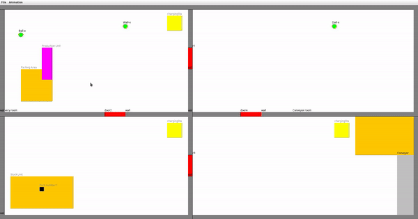

# ☁️ Sky Factory – Java Factory Design Pattern Demo



## Authors

- **Iliass Khoutaibi**
- [**Souhail Ait Fora**](https://github.com/SouhailAitFora)

## Overview

Sky Factory is a Java-based project that demonstrates the implementation of the Factory Design Pattern. The project includes two branches:

- **`master`**: Contains the stable, functional code agreed upon by both contributors.
- **`KHOUTAIBI`**: An experimental branch used for testing and prototyping. This branch is deprecated and should not be considered for production use.

## Features

- **Factory Design Pattern Implementation**: Showcases how to use the Factory Pattern to create objects without specifying the exact class of the object to be created.
- **Modular Code Structure**: Organized codebase for better readability and maintenance.
- **Animated GIF**: Visual representation of the Factory Pattern in action (`factory.gif`).

## What was Used?

- **Java**: Core programming language used for the implementation.

## Getting Started

To run the project locally:

1. **Clone the repository**:

   ```bash
   git clone https://github.com/KHOUTAIBI/Java-Factory.git
   cd Java-Factory
  `
2. **Project Structure**

Java-Factory/
├── .project  
├── README.md  
├── factory.gif  
├── src/  
